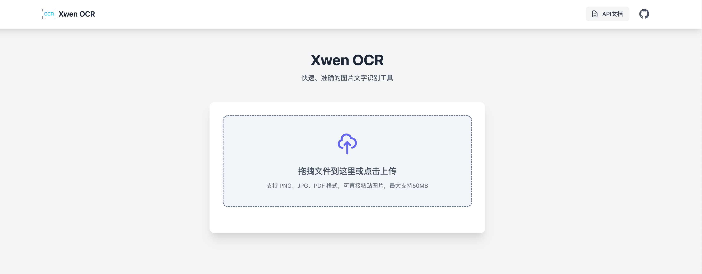

# OCR 服务

基于 Spring Boot 的 OCR 图片识别服务，提供高效、稳定的文字识别功能。



## 功能特点

- 支持图片文字识别
- 提供 RESTful API 接口
- 集成 Swagger 文档
- 全局异常处理
- PDF 文档支持

## 技术栈

- Spring Boot 2.7.14
- RapidOCR 0.0.7
- ONNX Runtime 1.14.0
- PDFBox 2.0.29
- Springfox Swagger 3.0.0
- Lombok

## 环境要求

- JDK 11+
- Maven 3.6+

## 快速开始

### 1. 克隆项目

```bash
git clone [项目地址]
cd ocr
```

### 2. 编译打包

```bash
mvn clean package
```

### 3. 运行服务

```bash
java -jar target/ocr.jar
```

服务启动后，可以通过以下地址访问：

- API 接口：http://localhost:8080
- Swagger 文档：http://localhost:8080/swagger-ui/

## API 文档

详细的 API 接口文档可通过 Swagger UI 查看，主要包括：

- 图片文字识别接口
- PDF 文档处理接口

## 异常处理

服务集成了全局异常处理机制：

- OCR 识别异常处理
- 通用异常处理

## 贡献指南

1. Fork 项目
2. 创建新的功能分支 (`git checkout -b feature/AmazingFeature`)
3. 提交更改 (`git commit -m 'Add some AmazingFeature'`)
4. 推送到分支 (`git push origin feature/AmazingFeature`)
5. 提交 Pull Request

## 许可证

[](https://opensource.org/licenses/MIT)

本项目采用 MIT 许可证，详情请参阅 [LICENSE](LICENSE) 文件。

## 联系方式

- 作者：wangxiuwen
